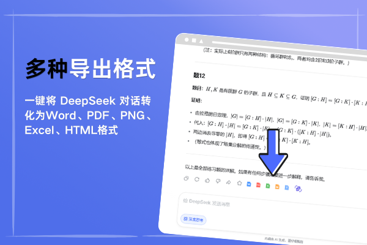

# DeepSeek Chat Exporter

将 DeepSeek 对话一键导出为 Word、PDF、Markdown 等格式的浏览器扩展，尽可能保留标题层级、代码高亮、Markdown 表格、LaTeX 数学公式和深度思考内容。

- 官方网站：[https://www.deepseekchatexporter.cn/](https://www.deepseekchatexporter.cn/)
- Chrome：[前往 Chrome Web Store 安装](https://chromewebstore.google.com/detail/%E9%B2%B8%E9%B1%BCai%E5%8A%A9%E6%89%8B-deepseek%E5%AF%BC%E5%87%BAword/foegcdhddlencjjkaeonjahfcdlmlihl)
- Edge：[前往 Microsoft Edge 扩展商店安装](https://microsoftedge.microsoft.com/addons/detail/%E9%B2%B8%E9%B1%BCai%E5%8A%A9%E6%89%8B/lgfpicokhhemdpohohdlffponcillpfa)
- Firefox：[前往 Firefox Add-ons 安装](https://addons.mozilla.org/zh-CN/firefox/addon/deepseek%E5%AF%BC%E5%87%BAword-%E9%B2%B8%E9%B1%BCai%E5%8A%A9%E6%89%8B/)

## 主要功能

- 将 DeepSeek 对话导出为常用文档格式
- 保留标题、段落、列表、引用和表格结构
- 保留代码块及语法高亮
- 支持常见 LaTeX 数学公式
- 支持保存深度思考内容
- 支持单条回答和完整对话导出
- 在浏览器本地整理并生成文件
- 支持 Chrome、Edge、Firefox 和兼容 Chromium 的浏览器

## 支持的导出格式

| 格式 | 适用场景 |
| --- | --- |
| Word | 报告、学习笔记、论文素材和可编辑文档 |
| PDF | 打印、分享和长期归档 |
| Markdown | Obsidian、知识库和技术写作 |
| HTML | 网页预览与内容发布 |
| JSON | 结构化保存与二次处理 |
| Jupyter Notebook | 编程、研究和数据分析 |

实际可用格式以当前扩展版本显示的选项为准。

## 安装扩展

### Google Chrome

[从 Chrome Web Store 安装 DeepSeek Chat Exporter](https://chromewebstore.google.com/detail/%E9%B2%B8%E9%B1%BCai%E5%8A%A9%E6%89%8B-deepseek%E5%AF%BC%E5%87%BAword/foegcdhddlencjjkaeonjahfcdlmlihl)

### Microsoft Edge

[从 Microsoft Edge 扩展商店安装](https://microsoftedge.microsoft.com/addons/detail/%E9%B2%B8%E9%B1%BCai%E5%8A%A9%E6%89%8B/lgfpicokhhemdpohohdlffponcillpfa)

### Mozilla Firefox

[从 Firefox Add-ons 安装](https://addons.mozilla.org/zh-CN/firefox/addon/deepseek%E5%AF%BC%E5%87%BAword-%E9%B2%B8%E9%B1%BCai%E5%8A%A9%E6%89%8B/)

### 360 浏览器

[查看 360 扩展商店页面](https://ext.se.360.cn/#/extension-detail?id=hgahdgilffiglaefnmnkoclmigdaighg)

最新安装入口和兼容性信息请查看[官方网站](https://www.deepseekchatexporter.cn/)。

## 使用方法

1. 安装适用于当前浏览器的扩展。
2. 打开 DeepSeek 网页端并进入需要保存的对话。
3. 点击浏览器工具栏中的扩展图标。
4. 选择单条回答或完整对话。
5. 选择 Word、PDF、Markdown 或其他输出格式。
6. 生成并下载文件。

## 适用场景

- 将 DeepSeek 回答整理成 Word 报告
- 保存包含公式和代码的学习资料
- 把 AI 对话整理进 Markdown 知识库
- 将长对话保存为便于分享的 PDF
- 归档研究、开发和办公过程中的 AI 内容

## 隐私说明

DeepSeek Chat Exporter 的内容整理和文件生成主要在浏览器本地完成。具体权限、数据处理范围和最新隐私政策，以浏览器扩展商店及[隐私政策](https://m.aiwhaler.com/privacy-policy-plugin-desp)中的说明为准。

请勿在需要导出的对话中包含密码、API 密钥、访问令牌、证件信息或其他不应公开的敏感资料。

## 仓库说明

本仓库主要用于维护 [DeepSeek Chat Exporter 官方网站](https://www.deepseekchatexporter.cn/)及产品介绍内容，不代表浏览器扩展的全部源代码已经开源。

仓库公开可见不等同于其中所有代码和内容均已按照开源许可证授权。除非文件中另有明确说明，否则请勿直接复制、重新发布或用于其他商业产品。

## 问题反馈

如果遇到安装、兼容性或导出问题，可以提交 [GitHub Issue](https://github.com/Lonely7th/DeepSeek-Chat-Exporter/issues)。

反馈时建议提供：

- 浏览器名称及版本
- 扩展版本
- 选择的导出格式
- 问题复现步骤
- 已移除个人信息的错误截图

## 品牌说明

DeepSeek Chat Exporter 是面向 DeepSeek 网页内容整理和导出的第三方效率工具。

本项目与 DeepSeek 官方不存在隶属、授权或代理关系。“DeepSeek”及相关名称和标识归其各自权利人所有。

---

DeepSeek Chat Exporter：让 AI 对话更容易编辑、分享和长期保存。
